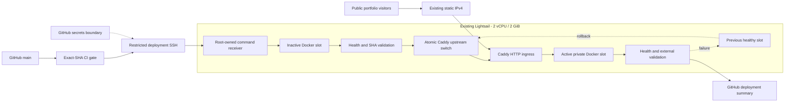
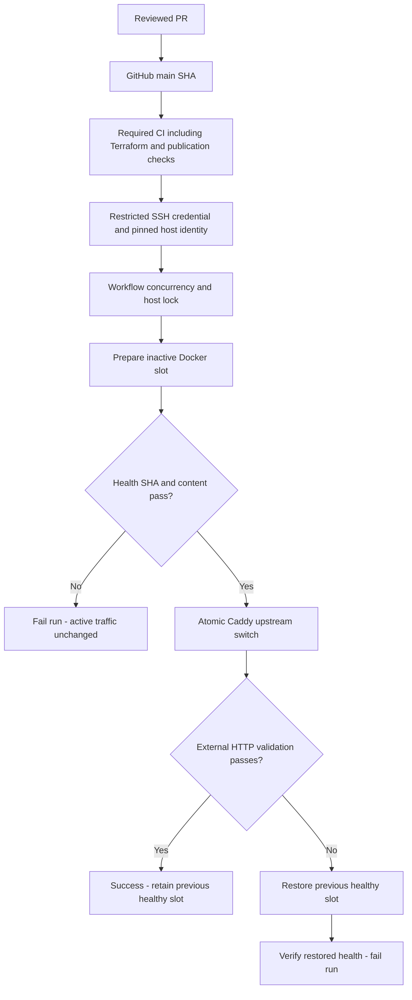
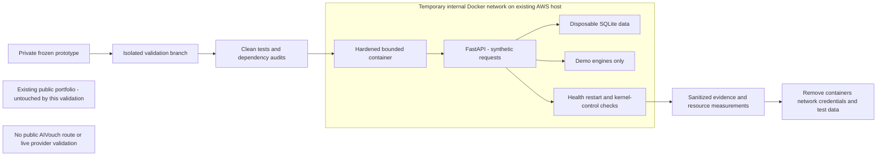
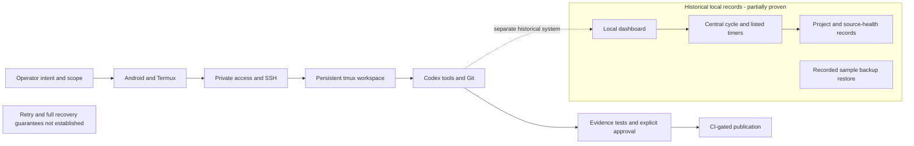
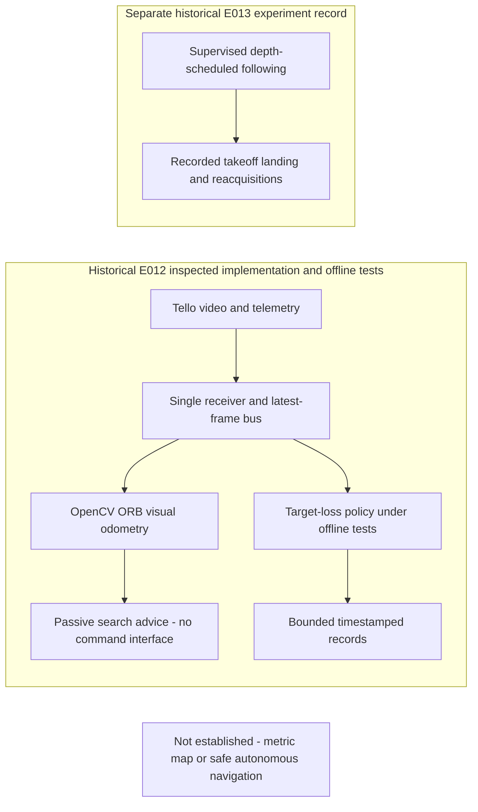
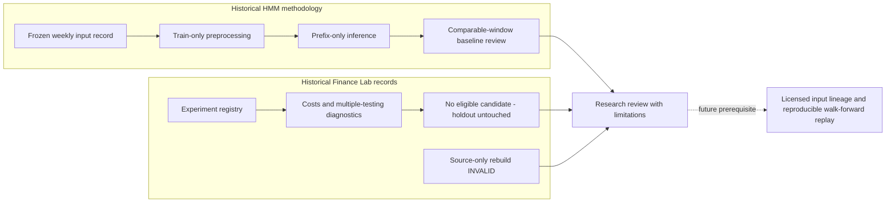
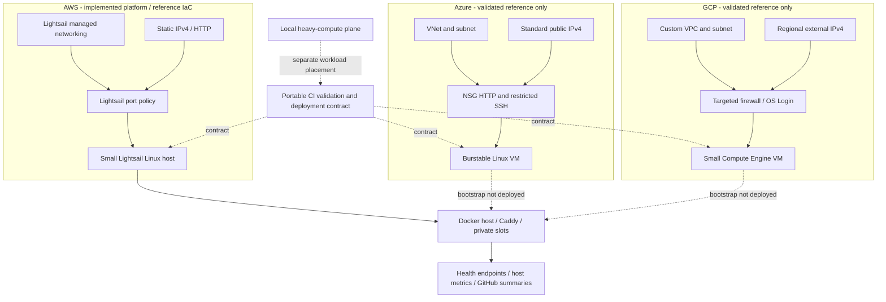

# Architecture evidence gallery

Seven required views, with implementation and evidence boundaries shown explicitly. All source diagrams and embedded Mermaid blocks are syntax-checked in CI; parsing is not a substitute for architecture review.

## Portfolio platform

Implemented single-host AWS platform; existing private backend bridge permits egress.

[Diagram source](../multicloud/current-aws.mmd)

## CI/CD and blue/green deployment

Implemented control flow. Live pre-switch isolation and immediate rollback are proven; current post-switch external-outage injection is not claimed.

[Diagram source](cicd-bluegreen.mmd)

## AIVouch validation

Completed private demo validation; disposable resources have been removed. No live external integration is implied.

[Diagram source](aivouch-validation.mmd)

## AI Operating System

Working remote model plus clearly separated historical orchestration records. General retries/recovery remain unproven.

[Diagram source](ai-operating-system.mmd)

## Air Marshal

Historical prototype and experiment architecture, not newly reproduced flight or completed navigation. E012 and E013 are distinct evidence scopes.

[Diagram source](air-marshal.mmd)

## Quantitative research

Conceptual synthesis of historical research records, not a currently reproduced end-to-end pipeline. Future work is dashed.

[Diagram source](quantitative-research.mmd)

## Multi-cloud Terraform comparison

AWS implemented platform; Terraform AWS ownership remains reference-only. Azure/GCP are validated references, not deployed.

[Diagram source](../multicloud/multicloud.mmd)
