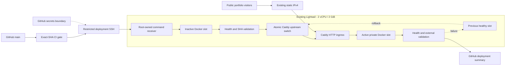
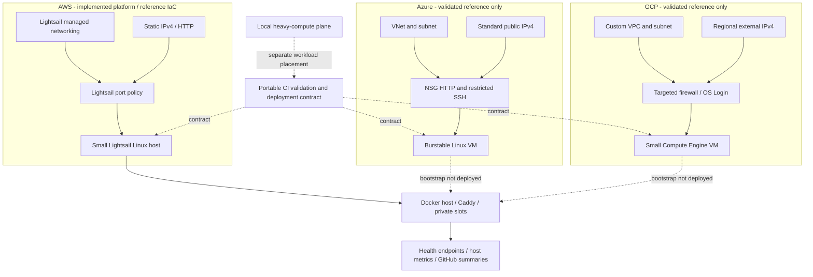

# Multi-cloud platform engineering

AWS is implemented; Azure and GCP are validated, undeployed references.

- [Terraform modules and safe validation](PHASE17_TERRAFORM.md)
- [AWS architecture](PHASE17_AWS_ARCHITECTURE.md)
- [Azure architecture](PHASE17_AZURE_ARCHITECTURE.md)
- [GCP architecture](PHASE17_GCP_ARCHITECTURE.md)
- [Security findings and decisions](PHASE17_SECURITY.md)
- [Cost discipline](PHASE17_FINOPS.md)
- [Validation evidence](PHASE17_VALIDATION.md)

## Current AWS platform

## Cloud equivalents

## Portability

| Portable contract | Cloud-specific implementation |
|---|---|
| Docker workloads and health endpoints | VM images, burst/CPU capacity and runtime bootstrap |
| Blue/green validation, traffic switch and rollback | Network interface, firewall and public-IP constructs |
| Terraform module interfaces and CI logic | Lightsail versus Azure resource groups/VNet versus GCP projects/VPC |
| Least privilege, secret separation, host verification | Cloud IAM, SSH public-key handling and GCP OS Login |
| Host/application monitoring signals | Native metrics, quotas, retention and billing |

Portability means reusable application and operational contracts with tested adapters, not identical cloud behavior. Only the AWS adapter has live deployment evidence.
