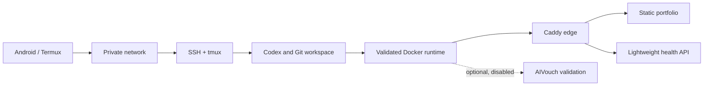

# System architecture

```mermaid
flowchart LR
  A[Android / Termux] --> B[Private network]
  B --> C[SSH + tmux]
  C --> D[Codex and Git workspace]
  D --> E[Validated Docker runtime]
  E --> F[Caddy edge]
  F --> G[Static portfolio]
  F --> H[Lightweight health API]
  E -. optional, disabled .-> I[AIVouch validation]
```

Only the edge is intended to face public HTTP. Application services stay internal and AIVouch remains disabled until separately approved.
